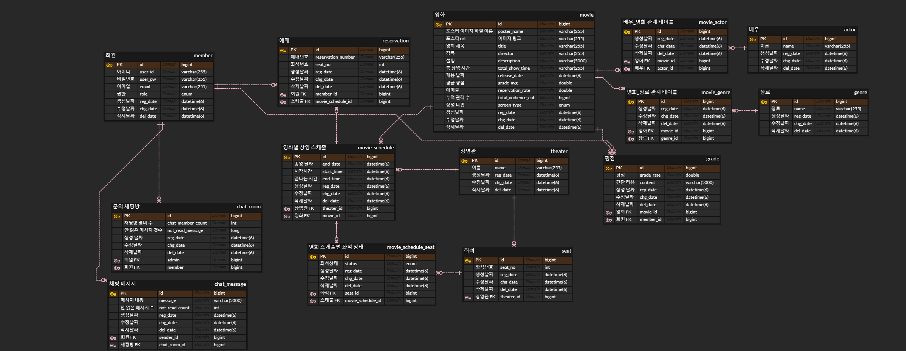

# 영화 예매 서비스

한 특정 지점의 극장에서 영화를 예매하고 평점을 남길 수 있는 api를 제공하는 서비스입니다.

# 사용 기술

- Spring boot
- Java 17
- Spring Batch
- Spring Security
- Spring jpa
- Spring Mail
- Redis
- Websocket
- QueryDsl
- Scheduler

# 프로젝트 기능 및 설계

## [회원]

- 회원가입 기능
    - 회원가입한 모든 사용자는 USER 권한(일반 권한)을 가진다.
    - 회원가입시 아이디와 패스워드, 이메일을 입력받으며, 아이디와 이메일은 unique해야한다.
    - 이메일을 통한 인증 완료 후 회원가입이 완료된다.
- 로그인 기능
    - 로그인 시 회원가입한 아이디와 패스워드가 일치해야한다.
    - 로그인 성공 시 JWT(`access token`, `refresh token`)을 발급받는다.
- 회원정보 수정 기능
    - 회원 및 관리자는 회원의 정보를 수정할 수 있다. 아이디, 패스워드, 이메일 정보를 수정 가능하다.
    - 수정 시에도 회원가입 때와 마찬가지로 아이디와 이메일은 unique해야한다.
- 회원탈퇴 기능
    - 회원은 언제든 탈퇴 가능하다.
    - 관리자는 회원을 탈퇴시킬 수 있다.
    - 단, 이미 예매가 되어있는 상태에서 탈퇴 시 해당 예매는 자동 취소처리된다.

## [상영관]

- 상영관등록 기능
    - 관리자는 상영관(1관, 2관, ..)의 정보를 등록할 수 있다.
    - 상영관은 상영관별 영화 상영 시간, 좌석(총 좌석 수, 남은 좌석 수, 좌석별 상태)의 정보를 담고 있다.
- 상영관 수정/삭제/조회 기능
    - 관리자는 상영관 정보를 수정, 삭제, 조회할 수 있다.

## [영화]

- 영화등록 기능
    - ADMIN 권한(관리자)을 가진 회원은 영화를 등록할 수 있다.
    - 상영 타입(`상영 예정작`, `현재 상영작`, `지난 상영작`), 감독, 출연진, 영화 제목, 설명, 총 상영 시간, 상영
      계획(`상영 기간`, `상영관 정보`와 `시작 시간`, `끝나는 시간`), 평점, 누적 관객 수, 예매율, 개봉 날짜의 정보를 가진다.
    - `지난 상영작`은 등록된 영화가 상영기간이 지난 경우 `지난 상영작`으로 변경되며, 상영 기간 이전의 영화는 `상영 예정작`, 상영 기간중인
      영화는 `현재 상영작`으로 구분된다. -> Batch, Scheduler 사용
    - 포스터 이미지는 대표 1개의 이미지만 등록한다. -> S3
    - 상영 계획의 시작 시간을 입력 시 끝나는 시간은 자동으로 총 상영 시간에 맞게 설정된다.
    - 영화 제목은 unique해야한다.
- 영화수정 기능
    - ADMIN 권한(관리자)을 가진 회원은 영화 정보를 수정할 수 있다.
    - 모든 정보를 수정 가능하다.
- 영화삭제 기능
    - ADMIN 권한(관리자)을 가진 회원은 영화를 삭제할 수 있다.
- 영화조회 기능
    - 모든 회원은 영화정보를 조회할 수 있다.
    - 검색 기능을 사용한다. 필터링이 가능하며 지난 상영작, 현재 상영작, 상영 예정작 / 장르 / 평점순, 관객순, 예매율순 의 필터링이 가능하다. -> queryDsl

## [예매]

- 예매 기능
    - 로그인한 유저는 예매가 가능하다.
    - 영화 이름, 상영관 정보(상영관과 해당 관의 시작 시간이 담긴 정보, 좌석)를 입력받는다.
    - 남은 좌석이 없다면 예약이 불가하다.
    - 예매 완료 시 예매 번호(오늘 날짜 + 랜덤 숫자 4자리), 영화 정보(포스터, 영화 이름), 상영관 정보(상영관, 시작 시간, 끝 시간)를 메일로 발송한다.
    - 메일 발송과 함께 예매 정보를 DB에 저장한다.
    - 예매 번호는 unique해야한다.
- 예매취소 기능
    - 회원 및 관리자는 예매를 취소할 수 있다.
    - 예매 번호를 통해 취소한다.
- 예매조회 기능
    - 회원 및 관리자는 예매를 조회할 수 있다.
    - 회원 아이디를 통해 해당 회원의 예매 리스트를 확인 가능하고 예매 번호를 통해 상세 조회가 가능하다.

## [평점]

- 평점 기능
    - 회원이 특정 영화에 대한 평점을 작성하려 할 시 회원이 해당 영화를 시청하였는지 확인 후 평점 작성이 가능하다.
    - 영화 이름, 평점(double), 간단한 글(nullable)을 작성할 수 있다.
- 평점 조회 기능
    - 회원 및 관리자는 영화별 평점 리스트, 회원별 평점 리스트를 조회할 수 있다.
    - pk를 통해 상세 조회가 가능하다.
- 평점 수정 기능
    - 회원은 작성한 평점에 대해 수정할 수 있다.
- 평점 삭제 기능
    - 회원 및 관리자는 평점을 삭제할 수 있다.(회원은 작성한 것만 삭제 가능)

## [문의]

- 문의 채팅 기능
    - 관리자와 회원간 1:1 채팅이 가능하다.

# ERD

